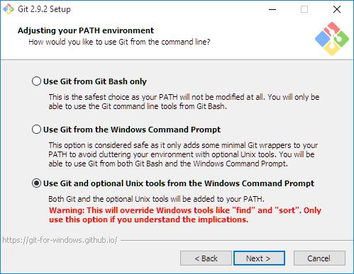
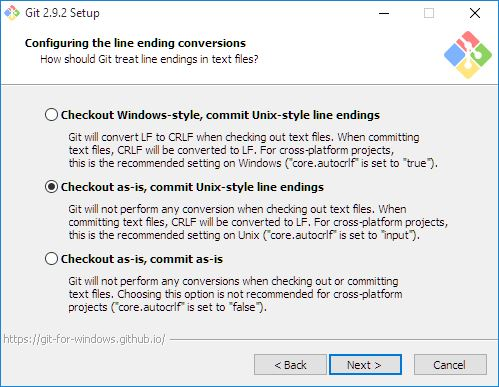

# Continuous Delivery With Jenkins Workshop Server Environment


The Vagrant and Puppet setup in this project installs and configures a virtual box environment for a Jenkins workshop. For instance, the environment can be used for a workshop about Continuous Delivery with Pipelines as Code.

The virtual box is provisioned with

* Jenkins
* Various Java JDKs
* Maven
* git
* Artifactory

It is possible to redistribute the box after it has been provisioned, and possibly configured manually. Both Jenkins and Artifactory require manual configuration. See below for instructions on how to do this.


Note that this project has only been tested on Windows, but is expected to work elsewhere too.

1. Download and install [Git](https://git-scm.com/download/). Important: see below for installation instructions on Windows.
2. Download and install [Vagrant](https://www.vagrantup.com/).
3. Download and install [VirtualBox](https://www.virtualbox.org/).
4. Clone this repo.
5. Have a look at the [Vagrantfile](https://github.com/mgfeller/cd-jenkins-workshop/blob/master/Vagrantfile) for up-to-date instructions and configuration.
6. Open a command line and navigate to the folder containing this repo.
7. Run `vagrant up` (this might take  while).
8. Run `vagrant ssh` to connect to the virtual box. This requires an SSH client. The (optional) Unix tools of the [Windows Git client](https://git-scm.com/download/win) include an SSH client.
9. Exit from this Linux terminal session.
10. Stop the virtual box using 'vagrant halt'.

If you are taking part in the corresponding workshop, please do not configure Jenkins and Artifactory. They will be set up and configured as part of the workshop.

The installation can be tested by opening http://192.168.33.10:8080 in a web browser to access Jenkins, and http://192.168.33.10:8081/artifactory/ to access Artifactory. The IP address corresponds to the one configured in the [Vagrantfile](https://github.com/mgfeller/cd-jenkins-workshop/blob/master/Vagrantfile). If the web pages are not available, a restart of the virtual box might solve the problem.


## Git Configuration On Windows

It is important to configure git under installation as shown below.





## Redistribute Provisioned Box

After provisioning and possible further manual configuration, the box can be redistributed to interested parties.

The following steps are needed to create a box image (size ca 3GB).

1. Run `vagrant halt`
2. Run `vagrant package --output cd-jenkins-workshop.box`
3. Copy cd-jenkins-workshop.box to a file share, or memory sticks.

## Import Redistributed Provisioned Box

The following steps are needed to import the box image.

1. Download and install [Vagrant](https://www.vagrantup.com/).
2. Download and install [VirtualBox](https://www.virtualbox.org/).
3. Obtain the packaged box from someone, and store it on your PC as e.g.  c:\box\cd-jenkins-workshop.box
4. Create a directory, e.g. c:\workshop.
5. Open a command line window, and navigate to c:\workshop
6. Run `vagrant init`
7. Edit the Vagrant file, adjust config.vm.box_url and config.vm.network if necessary:

    ```
    Vagrant.configure("2") do |config|
      config.vm.box = "cd-jenkins-workshop"

      # Adjust to correct path if necessary:
      config.vm.box_url = "file://c:/box/cd-jenkins-workshop.box"

      config.vm.provider "virtualbox" do |v|
        v.memory = 4096
      end

      config.vm.hostname = "jenkins-workshop"

      config.vm.network "private_network", ip: "192.168.33.10"

      config.vm.synced_folder "src/", "/work/src"
    end
    ```

8. Run `vagrant up` to start the box.
9. Test as described above.
